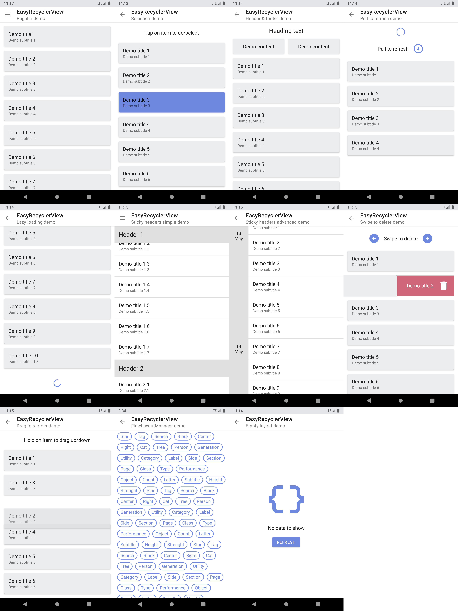

# 💡 Lightbulb-EasyRecyclerView

All-in-one easy to use RecyclerView for your android project

-------

### 📋 Features

- **Lifecycle aware adapter state** - Items loaded in the list outlive configuration changes (
  orientation change etc.)
- Selection support
- Drag to reorder support
- Pull to refresh support
- Swipe to delete support
- Lazy loading support
- Empty layout support
- Diff util support
- Header and footer list items support
- Sticky headers decoration
- Bounce effect on overscroll
- Different layout managers support: LinearLayoutVertical, LinearLayoutHorizontal, FlowLayoutVertical, FlowLayoutHorizontal

-------

## 🎨 Screenshots


## Latest releases 🛠

- Java & AndroidX
  | [v1.0.13](https://github.com/RooneyAndShadows/lightbulb-easyrecyclerview/tree/1.0.13)

# Setup

### 1. Add Jitpack repository to your project

```
repositories {
    ...
    maven {
        url 'https://jitpack.io'
    }
}
```

### 2. Provide the gradle dependency

```gradle
implementation 'com.github.rooneyandshadows:lightbulb-easyrecyclerview:1.0.13'
// Add recycler adapters support
implementation 'com.github.rooneyandshadows:lightbulb-recycleradapters:1.0.5'
```

### Note

> EasyRecyclerView works with adapters of type EasyRecyclerAdapter.

### 3. Describe the data model for the adapter

```java
public class DemoModel extends EasyAdapterDataModel {
    private final String title;
    private final String subtitle;


    public DemoModel(String title, String subtitle) {
        super(false);
        this.title = title;
        this.subtitle = subtitle;
    }

    // Parcelling part
    public DemoModel(Parcel in) {
        super(in);
        this.title = ParcelableUtils.readString(in);
        this.subtitle = ParcelableUtils.readString(in);
    }

    public static final Parcelable.Creator<DemoModel> CREATOR = new Parcelable.Creator<DemoModel>() {
        public DemoModel createFromParcel(Parcel in) {
            return new DemoModel(in);
        }

        public DemoModel[] newArray(int size) {
            return new DemoModel[size];
        }
    };

    @Override
    public void writeToParcel(Parcel parcel, int i) {
        super.writeToParcel(parcel, i);
        ParcelableUtils.writeString(parcel, title)
                .writeString(parcel, subtitle);
    }

    @Override
    public int describeContents() {
        return 0;
    }

    @Override
    public String getItemName() {
        return title;
    }

    public String getTitle() {
        return title;
    }

    public String getSubtitle() {
        return subtitle;
    }
}
```

### 4. Prepare your data adapter

```java
public class SimpleAdapter extends EasyRecyclerAdapter<DemoModel> {
    public SimpleAdapter() {
        super(new EasyAdapterConfiguration<DemoModel>());
    }

    @NonNull
    @Override
    public RecyclerView.ViewHolder onCreateViewHolder(@NonNull ViewGroup parent, int viewType) {
        ...
    }

    @Override
    public void onBindViewHolder(@NonNull RecyclerView.ViewHolder holder, int position) {
       ...
    }
}
```

### 5. Add the `EasyRecyclerView` into the XML

```xml
...
<com.github.rooneyandshadows.lightbulb.easyrecyclerview.EasyRecyclerView
    android:id="@+id/easy_recycler_view" android:layout_width="match_parent"
    android:layout_height="match_parent" />
...
```

### 6. Select the view in your activity/fragment and provide it with adapter

```java
@Override
protected void onViewCreated(View fragmentView,Bundle savedInstanceState){
    easyRecyclerView=getView().findViewById(R.id.recycler_view);
    easyRecyclerView.setAdapter(new SimpleAdapter());
    if(savedState==null)
        recyclerView.getAdapter().setCollection(generateInitialData());
}
```

And that's it. `EasyRecyclerView` is ready to use.

# Additional Setup

## Available attributes

```xml

<attr name="ERV_EmptyLayoutId" format="reference" /> //Layout to show when there is no data
<attr name="ERV_SupportsPullToRefresh" format="boolean" /> //Whether pull to refresh is supported.[default:false]
<attr name="ERV_SupportsLoadMore" format="boolean" /> //Whether lazy loading is supported.[default:false]
<attr name="ERV_SupportsOverscrollBounce" format="boolean" /> //Whether bounce on overscroll is supported.[default:false]
<attr name="ERV_LayoutManager" format="enum">//Type of the layout manager for the recyclerview[default:LAYOUT_LINEAR_VERTICAL]
    <enum name="LAYOUT_LINEAR_VERTICAL" value="1" />
    <enum name="LAYOUT_LINEAR_HORIZONTAL" value="2" />
    <enum name="LAYOUT_FLOW" value="3" />
</attr>
```

## Enable pull to refresh
### Note
> To use this feature you must enable it trough XMl by adding ERV_SupportsPullToRefresh="true"
```java
@Override
protected void onViewCreated(View fragmentView,Bundle savedInstanceState){
    easyRecyclerView.setRefreshCallback(view -> {
        ...
        List<DemoModel> generatedData = new ArrayList<>();
        easyRecyclerView.getAdapter().setCollection(generatedData);
        easyRecyclerView.showRefreshLayout(false);
    }
}
```
## Enable lazy loading 
### Note
> To use this feature you must enable it trough XMl by adding ERV_SupportsLoadMore="true"
```java

@Override
protected void onViewCreated(View fragmentView,Bundle savedInstanceState){
    easyRecyclerView.setRefreshCallback(view -> {
        ...
        List<DemoModel> generatedData = new ArrayList<>();
        recyclerView.getAdapter().appendCollection(generatedData);
        recyclerView.showLoadingFooter(false);
    }
}
```
## Enable swipe/drag of items
```java

@Override
protected void onViewCreated(View fragmentView,Bundle savedInstanceState){
    ...
    easyRecyclerView.setAdapter(new SimpleAdapter(), generateTouchCallback(easyRecyclerView));
}

private void generateTouchCallback(EasyRecyclerView<DemoModel, SimpleAdapter> recyclerView){
      return new EasyRecyclerViewTouchHandler.TouchCallbacks<DemoModel>() {
            @Override
            public Directions getAllowedSwipeDirections(DemoModel item) {
                return Directions.LEFT_RIGHT;
            }
        
            @Override
            public Directions getAllowedDragDirections(DemoModel item) {
                return Directions.UP_DOWN;
            }
        
            @Override
            public String getActionBackgroundText(DemoModel item) {
                return item.getItemName();
            }
        
            @Override
            public void onSwipeActionApplied(DemoModel item, int position, EasyRecyclerAdapter<DemoModel> adapter, Directions direction) {
                recyclerView.post(() -> {
                    int actualPosition = recyclerView.getAdapter().getPosition(item);
                    adapter.removeItem(actualPosition);
                });
            }
        
            @Override
            public void onActionCancelled(DemoModel item, EasyRecyclerAdapter<DemoModel> adapter, Integer position) {
            }
        
            @Override
            public int getSwipeBackgroundColor(Directions direction) {
                return ResourceUtils.getColorByAttribute(getContextActivity(), R.attr.colorError);
            }
        
            @Override
            public Drawable getSwipeIcon(Directions direction) {
                return ResourceUtils.getDrawable(recyclerView.getContext(), R.drawable.icon_delete);
            }
        
            @Override
            public String getPendingActionText(Directions direction) {
                return "Delete";
            }
        
            @Override
            public EasyRecyclerViewTouchHandler.SwipeConfiguration getConfiguration(Context context) {
                return new EasyRecyclerViewTouchHandler.SwipeConfiguration(getContext());
            }
    };
}
```
## Enable alternative empty layout
### Trough xml
```xml
<com.github.rooneyandshadows.lightbulb.easyrecyclerview.EasyRecyclerView
        android:id="@+id/easy_recycler_view" 
        android:layout_width="match_parent"
        android:layout_height="match_parent" 
        app:ERV_EmptyLayoutId="R.layout.yourlayout"/>
```

### Trough java
```java
@Override
protected void viewStateRestored(@Nullable Bundle savedInstanceState) {
    super.viewStateRestored(savedInstanceState);
    View emptyLayout = //...inflate/create view 
    recyclerView.setEmptyLayout(emptyLayout,new EasyRecyclerView.EasyRecyclerEmptyLayoutListener() {
              @Override
              public void onInflated(View view) {
                  super.onInflated(view);
              }
              
              @Override
              public void onShow(View view) {
                  super.onShow(view);
              }
              
              @Override
              public void onHide(View view) {
                  super.onHide(view);
              }
        });
}
```
**More detailed demonstrations you can find in the demo application.**